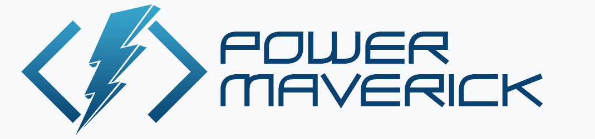

##  Hi

I am Danish Naglekar, also known as "Power Maverick" 🚀. I mainly work on Power Platform 💪 & Azure 🌠. I am an 🏃‍♂️ active contributor to Power Platform community.

> Learn new things, Share your knowledge and grow together as a community! - *Myself*

I'm always trying to grow and learn something new. My passion is technology & coding. 👨🏽‍💻

##  About me

- I run a [newsletter](http://www.powerplatformdevelopersweekly.com) 📰 focused on Power Platform for Pro-developers.
- I am the creator of **PCF Builder** tool for [XrmToolBox](https://github.com/Power-Maverick/PCF-CustomControlBuilder) and [VSCode](https://github.com/Power-Maverick/PCF-Builder-VSCode).
- I am a blogger, vlogger, speaker, mentor & trainer
- I am a Microsoft MVP in Business Application

    

##  Chat

- Power Apps Component Framework (PCF)
- Power Apps
- Power Automate
- Power Virtual Agent
- Common Data Services
- Azure (WebApp, ServiceBus, Functions, Logic apps, etc.)
##  Find me

     

**[https://powermaverick.dev](https://powermaverick.dev/)**

---

<!--
**Power-Maverick/Power-Maverick** is a ✨ _special_ ✨ repository because its `README.md` (this file) appears on your GitHub profile.

Here are some ideas to get you started:

- 🔭 I’m currently working on ...
- 🌱 I’m currently learning ...
- 👯 I’m looking to collaborate on ...
- 🤔 I’m looking for help with ...
- 💬 Ask me about ...
- 📫 How to reach me: ...
- 😄 Pronouns: ...
- ⚡ Fun fact: ...
-->
